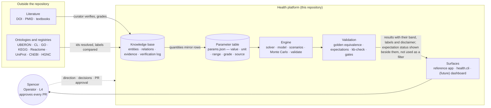
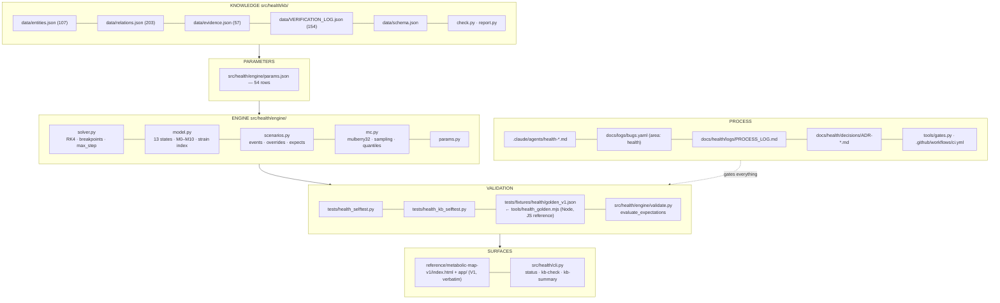
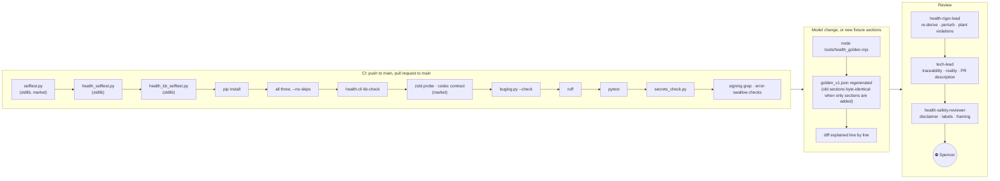
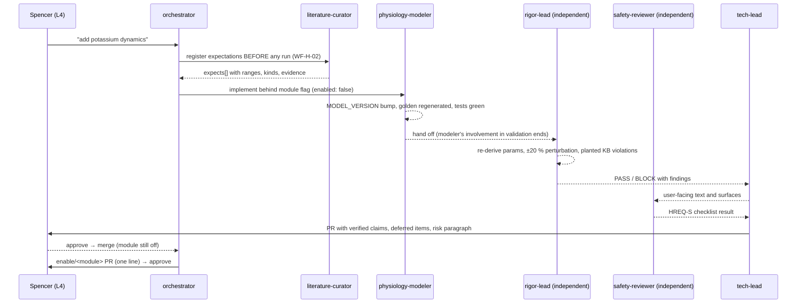
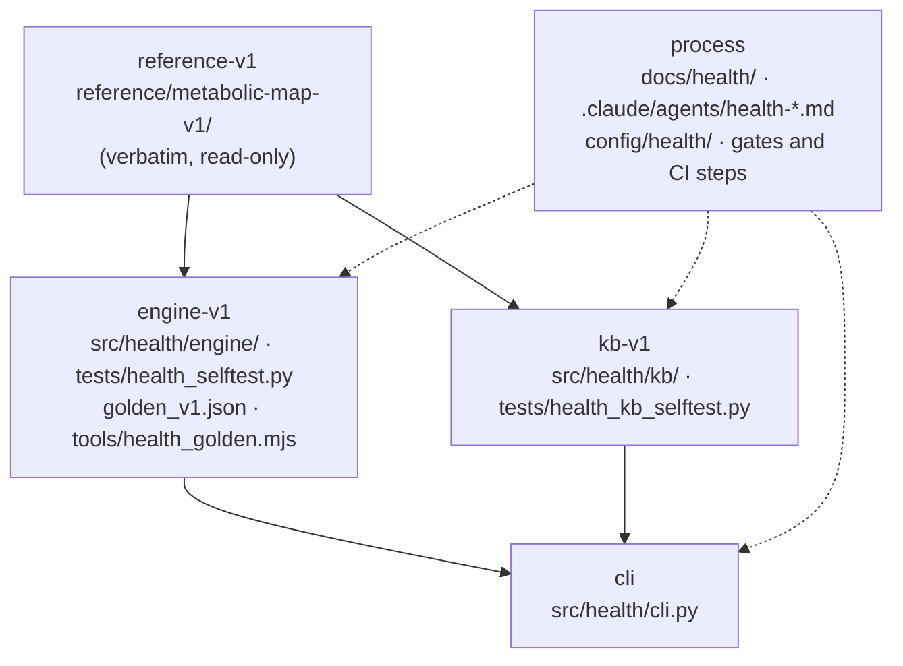
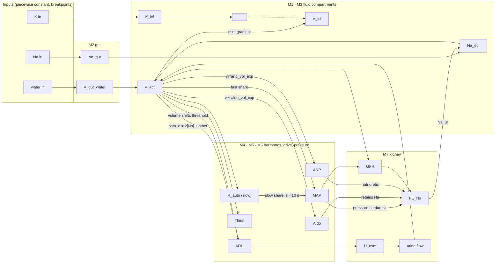
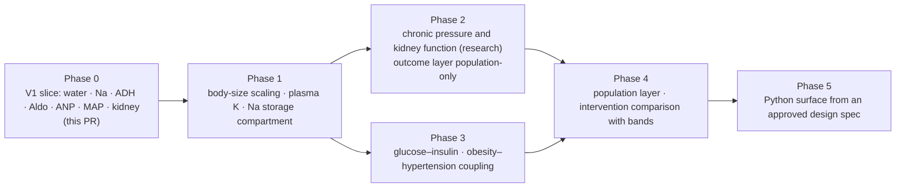

# Architecture — Health

**Version:** 0.1 · **Date:** 2026-10-03 · **Status:** Draft for Operator review
**Companion to:** `00_REQUIREMENTS.md`, `04_ENVIRONMENTS_AND_UNDO.md`, `07_MODULE_REGISTRY.md`
**Diagram sources:** `docs/health/diagrams/` (Mermaid `.mmd` files render on GitHub; `architecture.svg` is the static overview)

Every figure here is also a file under `diagrams/`, so a diagram can be changed in one
place and the change reviewed as a diff. The text beside each figure says what the
figure cannot: *why* the boundary is where it is and what it costs.

---

## 1. System context

**Why the knowledge base and the parameter table are two things.** The knowledge base
describes the world (what the kidney is, what a source says). The parameter table
describes the *model's* use of it (which number, in which equation, with which grade).
A quantity in the knowledge base can `engineParam`-mirror a parameter row, and
`kb-check` fails if they disagree, but the two are owned by different agents
(`02 §3`) so a tuned value cannot quietly inherit a grade.

---

## 2. Layers and files

Counts are from the vendored V1 files (`reference/metabolic-map-v1/kb/*.json`,
`engine/params.json`) at model 1.0.1. `health.cli status` recomputes them from the data on
every run; the figure is a snapshot of that output, not a second source.

**Cost of the split.** The JavaScript reference stays authoritative for the browser and
the Python engine for the gates, so a model change is made twice. That is deliberate
(`decisions/ADR-0002`): the second implementation is the cheapest independent check of
the first, and the golden fixture makes the agreement a test rather than a belief.

---

## 3. From a citation to a chart

```mermaid
flowchart LR
  E["Evidence record<br/>ev:robertson-athar-1976<br/>DOI · PMID · quote · accessed"]
  VR["Verification<br/>method · checkedOn · retraction · errata"]
  Q["Quantity<br/>value 281.0 · unit mOsm/kg<br/>range [278, 285.5] · grade A-primary"]
  P["params.json row<br/>adh_threshold<br/>engineParam mirror checked by kb-check"]
  M["model.py block M4<br/>ADH_target = max(0, slope · (osm − threshold))"]
  S["simulate()<br/>default params · scenario · dt · seed"]
  MC["simulate_mc()<br/>n samples · q05 · q50 · q95"]
  H["evaluate_expectations()<br/>one row per registered expectation<br/>pass · fail · not_checked"]
  C["Chart<br/>band + median + reference lines<br/>disclaimer · evidence chip · grade"]
  E --> VR --> Q --> P --> M --> S --> MC --> H --> C
  P -.->|"paramsFor(key): influence screen"| C
```

Every arrow is a place a number can go wrong, and each has a check: verification
(`02 §2.2`), the engineParam mirror (`kb-check`), the M-block audit against the JS
reference (golden test), the band (`HREQ-U`; a requirement with no result-schema gate yet,
`01` Appendix A), the harness row count (`ExpectationSkippedError`), and the surface
checklist (safety review, by hand).

---

## 4. The validation pipeline

The triggers and the step order are those of `.github/workflows/ci.yml`: the job runs on
a push to `main` and on a pull request to `main` (each push to its branch re-runs it), and
a failed step stops the job, so every step after it is skipped. A push to a branch with no
pull request open against `main` runs no CI; `tools/gates.py`, run by the agent before
claiming green, is then the only gate. The
stdlib-only steps run **before** `pip install` on purpose (`docs/03 §4.6`): a suite that
cannot run until the environment is built cannot tell you the environment is broken.
This round adds `tests/health_errors_selftest.py` and a golden `--check` step in
`tools/gates.py` that runs where a Node binary exists and prints a loud SKIPPED otherwise;
the figure shows the workflow before any CI step for either, and is redrawn if the merge
adds one. [VERIFY-AFTER-MERGE]

---

## 5. How work flows through the agents

---

## 6. Modules and how they come apart

Arrows point from a dependency to what needs it. Removal goes against the arrows: `cli`
first, then `engine-v1` or `kb-v1`, then `reference-v1`; `process` can be removed at any
time because nothing imports it. Every entry in `config/health/modules.yaml` carries the
recipe (`04 §6.5`), and the registry is the only place the dependency edges are recorded.

---

## 7. The model, as a feedback diagram

Thirteen states, as in `model.js` `STATE_KEYS`; the block labels (M0–M8 and M10; neither
implementation has an M9, BUG-20261003-099) match the code comments in both
implementations so the audit path is: diagram → block → two
implementations → golden test. The kidney strain index (M10) is a derived quantity, not
a state, and is deliberately absent from this figure: it summarises four of these loads,
it is not a loop.

---

## 8. Scientific roadmap as modules

Each phase is one or more modules under `07_MODULE_REGISTRY.md`, each landing with its
flag off, its expectations registered first, and its own ADR.

---

## 9. What is deliberately not here

- **No database.** JSON files with a schema and code-enforced cross-file rules are diffable, reviewable and append-only friendly. The day a query needs a database, that is an ADR.
- **No service.** Nothing listens on a port. The reference app is static; the CLI is a process that exits.
- **No personal data.** Not a field, not a column, not a plan. A module that needs it is a separate amendment (`00 §1.4`).
- **No adaptive solver.** Fixed-step RK4 bounded by the fastest time constant is what V1 validated; a stiff module later gets its own ADR and its own golden protocol.
